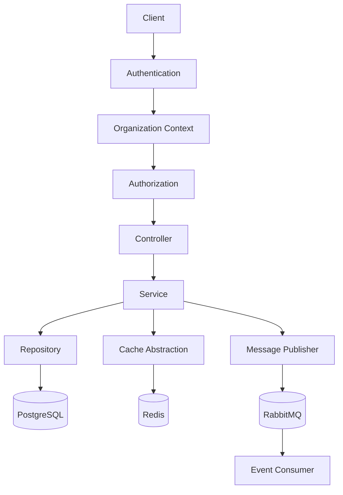

# Architecture

This document describes the architectural decisions behind the project, how the application is organized, and the principles that guided its implementation.

Rather than focusing on the business domain itself, the project emphasizes architectural concerns commonly encountered in modern SaaS applications, including tenant isolation, authorization, infrastructure abstraction, asynchronous processing, and maintainable module boundaries.

---

# High-Level Architecture



The application follows a layered modular architecture where business modules remain independent from infrastructure concerns through well-defined abstractions.

Synchronous request processing is combined with asynchronous event handling to keep business workflows responsive while delegating non-critical work to background consumers.

---

# Architectural Style

The project combines several architectural patterns commonly used in production backend systems.

| Pattern                    | Purpose                                                                                           |
| -------------------------- | ------------------------------------------------------------------------------------------------- |
| Layered Architecture       | Separates presentation, business, persistence, and infrastructure concerns                        |
| Modular Monolith           | Organizes the application into independent business modules without distributed system complexity |
| Repository Pattern         | Encapsulates persistence and isolates TypeORM from business logic                                 |
| Dependency Injection       | Reduces coupling between modules and improves testability                                         |
| Event-Driven Communication | Decouples asynchronous workflows through RabbitMQ                                                 |

Although asynchronous messaging is used for selected workflows, the application intentionally remains a modular monolith.

This approach provides clear module boundaries while avoiding the operational overhead introduced by microservices.

---

# Project Organization

The source code is organized into business modules and shared infrastructure modules.

```text
src/
├── modules/
│
├── auth/
├── organizations/
├── memberships/
├── users/
├── projects/
├── tasks/
│
├── cache/
├── redis/
├── rabbitmq/
├── messaging/
├── email/
│
├── database/
├── common/
└── core/
```

## Module Responsibilities

### Business Modules

| Module        | Responsibility                                         |
| ------------- | ------------------------------------------------------ |
| Auth          | User authentication and refresh token management       |
| Organizations | Organization lifecycle and invitation workflows        |
| Memberships   | Organization membership validation and role resolution |
| Projects      | Project management within an organization              |
| Tasks         | Task management, assignment, and filtering             |
| Users         | User profile management                                |

### Infrastructure Modules

| Module    | Responsibility                                   |
| --------- | ------------------------------------------------ |
| Cache     | Cache abstraction and invalidation               |
| Messaging | Event publishing and message consumption         |
| Database  | Database configuration and persistence           |
| Common    | Shared application infrastructure and utilities  |
| Core      | Application composition and global configuration |

---

# Dependency Rules

The project follows a strict dependency flow to keep responsibilities well-defined and prevent business logic from leaking across layers.

```text
Controller
    │
    ▼
Service
    │
    ▼
Repository
    │
    ▼
Database

Service
    │
    ├────────────► Cache
    │
    └────────────► Messaging
```

Each layer depends only on the layer directly beneath it. Infrastructure services are accessed through abstractions, allowing implementation details to remain isolated from business logic.

The following rules are enforced throughout the application:

| Layer          | Responsibilities                                                                | Avoid                                             |
| -------------- | ------------------------------------------------------------------------------- | ------------------------------------------------- |
| Controller     | HTTP handling, request validation, authentication and authorization integration | Business logic, persistence                       |
| Service        | Business rules, workflow orchestration, cache management, event publishing      | HTTP concerns, SQL queries                        |
| Repository     | Persistence and tenant-scoped queries                                           | Business logic, authorization, cache invalidation |
| Infrastructure | External integrations such as Redis, RabbitMQ, and email                        | Domain-specific business rules                    |

---

# Module Communication

Feature modules communicate through their public services rather than directly accessing each other's repositories.

For example:

```text
ProjectService
        │
        ▼
MembershipService
```

Instead of:

```text
ProjectService
        │
        ▼
MembershipRepository
```

This approach provides several benefits:

- Each module remains responsible for its own business rules.
- Internal implementation details remain encapsulated.
- Module dependencies stay loosely coupled.
- Business logic has a single source of truth.

Repositories are considered internal implementation details and are not intended to be shared across feature modules.

---

# Request Lifecycle

Every authenticated request follows the same processing pipeline.

A typical request is processed as follows:

1. The user's JWT access token is validated.
2. The active organization context is resolved.
3. Organization membership is verified.
4. Role-based authorization requirements are evaluated.
5. The appropriate business service executes the requested use case.
6. Tenant-scoped repositories perform database operations.
7. Cached data is updated or invalidated when necessary.
8. Asynchronous domain events are published for background processing when required.

This lifecycle ensures that authentication, tenant isolation, authorization, and business rules are consistently enforced before any data is persisted.

---

# Cross-Cutting Concerns

Several concerns apply consistently across multiple modules and are implemented as shared infrastructure rather than duplicated within individual features.

| Concern            | Implementation                                          |
| ------------------ | ------------------------------------------------------- |
| Authentication     | JWT-based authentication guards                         |
| Authorization      | Role-based guards and decorators                        |
| Validation         | Request DTO validation                                  |
| Exception Handling | Global exception filter with standardized API responses |
| API Documentation  | Shared Swagger decorators                               |
| Pagination         | Reusable pagination utilities                           |
| Dynamic Filtering  | Shared filtering infrastructure                         |
| Caching            | Cache provider abstraction                              |
| Messaging          | Publisher and consumer abstractions                     |

Centralizing these concerns promotes consistency while reducing duplication across the application.


---

# Architectural Principles

The architecture is guided by a small set of principles that influence implementation decisions throughout the project.

| Principle                   | Rationale                                                                                                                                                           |
| --------------------------- | ------------------------------------------------------------------------------------------------------------------------------------------------------------------- |
| Explicit over Implicit      | Critical behaviors such as tenant scoping, authorization, and cache invalidation remain visible in the codebase rather than relying on hidden framework mechanisms. |
| Separation of Concerns      | Business logic, persistence, and infrastructure are isolated to improve maintainability and testability.                                                            |
| Infrastructure Independence | Business modules communicate with Redis, RabbitMQ, and other external systems through abstractions rather than concrete implementations.                            |
| Simplicity                  | The project favors straightforward solutions over introducing architectural patterns that provide little value for its intended scope.                              |

---

# Notable Architectural Decisions

Several implementation decisions were made intentionally to balance simplicity with production-oriented design.

| Decision                         | Details                                                                                                               |
| -------------------------------- | --------------------------------------------------------------------------------------------------------------------- |
| Explicit tenant scoping          | Repository queries are explicitly scoped by `organizationId` instead of implicit data-access mechanisms.                |
| Simple RBAC model                | Authorization is based on three organization roles: Owner, Admin, and Member.                                         |
| Single active refresh session    | Each user maintains one active refresh session to simplify session management while supporting secure token rotation. |
| Version-based cache invalidation | Cached project lists are invalidated by incrementing cache versions instead of deleting individual cache entries.     |
| Event-driven invitation workflow | User invitation emails are processed asynchronously through RabbitMQ.                                                 |

Each of these topics is documented in greater detail within the corresponding documentation pages.

---

# Related Documentation

The following documents provide a deeper explanation of individual architectural components.

| Document            | Description                                                    |
| ------------------- | -------------------------------------------------------------- |
| `authentication.md` | Authentication flow, refresh tokens, and session management    |
| `multi-tenancy.md`  | Tenant isolation strategy and organization-scoped architecture |
| `caching.md`        | Redis integration and cache invalidation strategy              |
| `messaging.md`      | RabbitMQ architecture and asynchronous event processing        |
| `error-handling.md` | Exception hierarchy and API error responses                    |
| `testing.md`        | Testing strategy and project testing philosophy                |

---

# Summary

The project is intentionally designed as a modular monolith with clear architectural boundaries.

Rather than maximizing the number of implemented features, the focus is on demonstrating maintainable backend engineering practices such as explicit tenant isolation, layered architecture, infrastructure abstraction, role-based authorization, distributed caching, and asynchronous messaging.

The result is a codebase that emphasizes readability, testability, and predictable behavior while remaining approachable for future extension.
