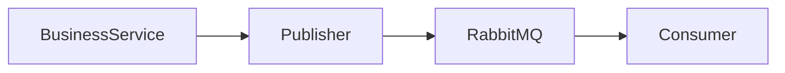

# Asynchronous Processing

This document describes how asynchronous processing is implemented within the application and the reasoning behind the selected design.

Rather than performing every operation during the request lifecycle, the application delegates non-critical work to background consumers through a messaging abstraction.

This approach keeps API responses fast while allowing external operations to execute independently.

---

# Architecture

Business services never communicate with RabbitMQ directly.

Instead, asynchronous workflows are initiated through a messaging abstraction.

This separation keeps business logic independent from the messaging technology while allowing the messaging implementation to evolve without affecting feature modules.

---

# Event Flow

When a business operation requires asynchronous processing, the following sequence occurs:

1. The business operation completes successfully.
2. A domain event is published.
3. RabbitMQ delivers the event to the appropriate consumer.
4. The consumer performs the background operation.
5. The original HTTP request is unaffected by the outcome of the background task.

This separation prevents long-running external operations from increasing request latency.

---

# Current Events

The current implementation publishes a single domain event.

| Event          | Purpose                                                        |
| -------------- | -------------------------------------------------------------- |
| `user.invited` | Sends an organization invitation email after a user is invited |

When the event is consumed:

- The invitation URL is generated.
- The invitation email is prepared.
- The email service delivers the message.

Although only one event is currently implemented, the messaging architecture is designed to support additional asynchronous workflows without requiring changes to existing business modules.

---

# Architectural Decisions

Several decisions influenced the design of the asynchronous processing layer.

| Decision                    | Rationale                                                                     |
| --------------------------- | ----------------------------------------------------------------------------- |
| Publisher abstraction       | Keeps business modules independent from RabbitMQ.                             |
| Asynchronous email delivery | Prevents external email providers from increasing API response time.          |
| Event-driven communication  | Allows business operations and background processing to evolve independently. |
| Consumer ownership          | Each consumer is responsible for a single business workflow.                  |

These decisions prioritize maintainability and separation of concerns while keeping the messaging architecture straightforward.

---

# Failure Handling

If an event cannot be processed immediately, the failure does not affect the original HTTP request because the business operation has already completed successfully.

Responsibility for retrying or recovering failed background operations belongs to the messaging infrastructure rather than the business service that published the event.

This separation allows business services to remain focused on domain logic without becoming coupled to delivery concerns.

---

# Extending the Messaging Layer

The messaging architecture is designed to support additional asynchronous workflows with minimal impact on existing modules.

A typical extension consists of:

1. Publishing a new domain event.
2. Registering a consumer for that event.
3. Implementing the background business operation.

Existing publishers and consumers remain unchanged, allowing new workflows to be introduced without modifying established message pipelines.

---

# Related Documentation

| Document            | Description                                              |
| ------------------- | -------------------------------------------------------- |
| `architecture.md`   | Overall application architecture and module boundaries   |
| `authentication.md` | User authentication and invitation flow                  |
| `multi-tenancy.md`  | Organization-scoped application design                   |
| `caching.md`        | Redis integration and cache strategy                     |
| `testing.md`        | Testing asynchronous workflows and background processing |
