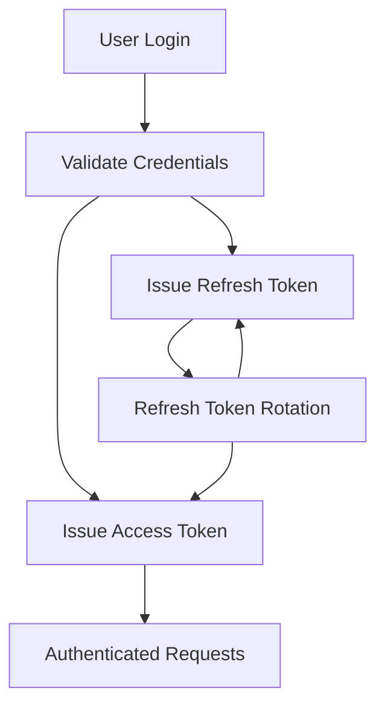

# Authentication

This document describes the authentication architecture, token lifecycle, and session management strategy used throughout the application.

The authentication system is designed around stateless JWT access tokens and opaque refresh tokens stored in the database.

Its primary goals are:

- Secure authentication
- Stateless request authorization
- Refresh token rotation
- Simple session management
- Clear separation between authentication and authorization

---

# Authentication Flow

Authentication consists of two independent stages.

After a successful login:

1. User credentials are validated.
2. A JWT access token is generated.
3. A cryptographically secure opaque refresh token is generated.
4. The refresh token is hashed and stored in the database.
5. Both tokens are returned to the client.

Access tokens authorize API requests.

Refresh tokens are used exclusively to obtain new access tokens after expiration.

---

# Token Strategy

The authentication system intentionally uses two different token types.

| Token         | Purpose                                              |
| ------------- | ---------------------------------------------------- |
| Access Token  | Short-lived JWT used for request authorization       |
| Refresh Token | Opaque random value used to obtain new access tokens |

Unlike access tokens, refresh tokens contain no user information and cannot be interpreted by clients.

Only the hashed representation of each refresh token is persisted, reducing the impact of database compromise.

This separation keeps authorization fast while minimizing long-term credential exposure.

---

# Token Contents

The access token contains only the information required for request authentication.

The active organization is **not** embedded within the token.

Instead, organization context is resolved independently for each request, allowing users to interact with multiple organizations without requiring separate authentication sessions.

---

# Refresh Token Lifecycle

Refresh tokens are rotated on every successful refresh request.

The refresh process follows these steps:

1. Validate the presented refresh token.
2. Compare it against the stored hashed value.
3. Invalidate the existing refresh token.
4. Generate a new access token.
5. Generate a new refresh token.
6. Store the hashed refresh token.
7. Return the new token pair.

Rotating refresh tokens limits the lifetime of compromised credentials and reduces the risk of replay attacks.

---

# Session Management

The application intentionally supports a single active refresh session per user.

Whenever a user authenticates successfully, the previously stored refresh token is replaced.

This approach keeps session management straightforward while still supporting secure refresh token rotation.

Supporting multiple concurrent sessions would require additional concepts such as:

- Device tracking
- Session identifiers
- Session revocation
- User session management

These concerns were intentionally excluded to keep the project focused on demonstrating authentication architecture rather than comprehensive account management.

---

# Security Considerations

Several implementation decisions were made to reduce credential exposure and improve overall security.

| Decision                  | Rationale                                               |
| ------------------------- | ------------------------------------------------------- |
| Hashed refresh tokens     | Prevents storing reusable credentials in plain text     |
| Opaque refresh tokens     | Keeps long-lived credentials free from user information |
| Refresh token rotation    | Limits replay opportunities after token use             |
| Short-lived access tokens | Reduces the impact of leaked JWTs                       |
| JWT identifier (`jti`)    | Enables unique identification of issued access tokens   |

These measures work together to provide a secure authentication flow while keeping the implementation relatively simple.

---

# Related Documentation

Authentication is closely integrated with several other architectural concerns documented within this repository.

| Document           | Description                                            |
| ------------------ | ------------------------------------------------------ |
| `architecture.md`  | Overall application architecture and request lifecycle |
| `multi-tenancy.md` | Organization context and tenant isolation strategy     |
| `caching.md`       | Caching strategy and cache abstractions                |
| `asynchronous-processing.md` | Background processing architecture              |
| `testing.md`       | Authentication and authorization testing strategy      |
