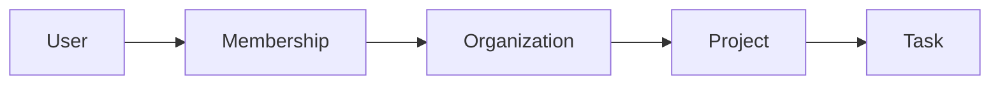
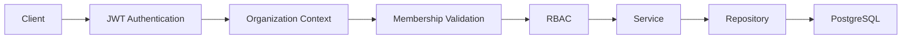

# Multi-Tenancy

This document describes how tenant isolation is implemented throughout the application and the design decisions behind the chosen approach.

The project follows an **organization-scoped** multi-tenant architecture where each organization represents an isolated tenant.

All business operations are executed within the context of an organization, ensuring that data belonging to one organization is never accessible from another.

---

# Tenant Model

Each organization acts as an independent tenant.

Users may belong to multiple organizations through memberships, with each membership defining the user's role within that organization.

This model allows a single user account to participate in multiple organizations while keeping each organization's data isolated.

---

# Tenant Isolation Strategy

Tenant isolation is implemented through explicit repository scoping.

Every repository query operating on tenant-owned resources requires an `organizationId`, ensuring that data access is always constrained to the active organization.

Because tenant ownership is expressed directly in repository methods, query behavior remains predictable and tenant boundaries are easy to review throughout the codebase.

---
# Why Explicit Repository Scoping?

Several approaches exist for implementing tenant isolation, this project intentionally uses **explicit repository scoping**,

This decision was made to keep tenant ownership visible throughout the codebase rather than hidden behind infrastructure or framework abstractions.

The approach provides several benefits:

- Repository methods clearly communicate tenant ownership.
- Database queries remain predictable and easy to debug.
- Tenant boundaries are straightforward to review.
- Cross-tenant access is less likely to occur accidentally.

Although explicit scoping introduces a small amount of additional boilerplate, it keeps tenant isolation easy to understand and maintain.

---

# Enforcing Tenant Isolation

Tenant isolation is enforced through multiple layers of the application rather than relying on a single mechanism.

Each layer is responsible for preventing a different class of cross-tenant access.

| Layer                 | Responsibility                                       |
| --------------------- | ---------------------------------------------------- |
| Authentication        | Identifies the authenticated user                    |
| Organization Context  | Resolves the active organization from the request    |
| Membership Validation | Verifies the user belongs to the active organization |
| Authorization         | Evaluates organization-specific permissions          |
| Repository            | Restricts database queries using `organizationId`    |

Because these checks are performed before business operations execute, services can safely assume that the active tenant has already been validated.

---

# Request Flow

Every organization-scoped request follows the same validation pipeline.

The request is processed as follows:

1. The user is authenticated using a JWT access token.
2. The active organization is resolved from the request headers.
3. The user's membership within that organization is verified.
4. Role-based authorization requirements are evaluated.
5. Business logic executes.
6. Repository queries are explicitly scoped by `organizationId`.

This sequence ensures that tenant boundaries are validated before any tenant-owned data is accessed.

---
# Development Safeguards

Runtime validation is the primary mechanism for enforcing tenant isolation.

To reduce the likelihood of developer mistakes, the project also includes a custom ESLint rule that detects repository queries missing tenant scoping.

This additional safeguard helps identify potential issues during development before they become runtime bugs.

Static analysis cannot guarantee complete tenant safety, but it complements runtime validation by reinforcing the project's architectural rules.

---

# Trade-offs

The chosen approach intentionally favors explicitness over automation.

### Advantages

- Tenant ownership is visible in every repository query.
- Query behavior is predictable and easy to debug.
- Tenant boundaries are straightforward to review during code reviews.
- Tenant scoping remains visible within application code rather than hidden behind repository wrappers or database-level policies.

### Limitations

- Repository methods require additional parameters.
- Developers must consistently include `organizationId` when implementing new queries.
- Explicit scoping requires more boilerplate than repository wrappers or database-level policies.

These trade-offs were considered acceptable because the resulting codebase is easier to understand, review, and maintain.

---

# Related Documentation

Multi-tenancy is closely related to several other architectural concerns documented within this repository.

| Document            | Description                                              |
| ------------------- | -------------------------------------------------------- |
| `architecture.md`   | Overall application architecture and module organization |
| `authentication.md` | Authentication flow and organization context resolution  |
| `caching.md`        | Cache strategy and tenant-aware cache invalidation       |
| `asynchronous-processing.md`      | Asynchronous processing and event-driven workflows       |
| `testing.md`        | Testing strategy for tenant isolation and business rules |
